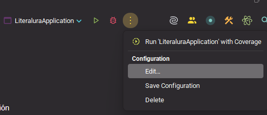
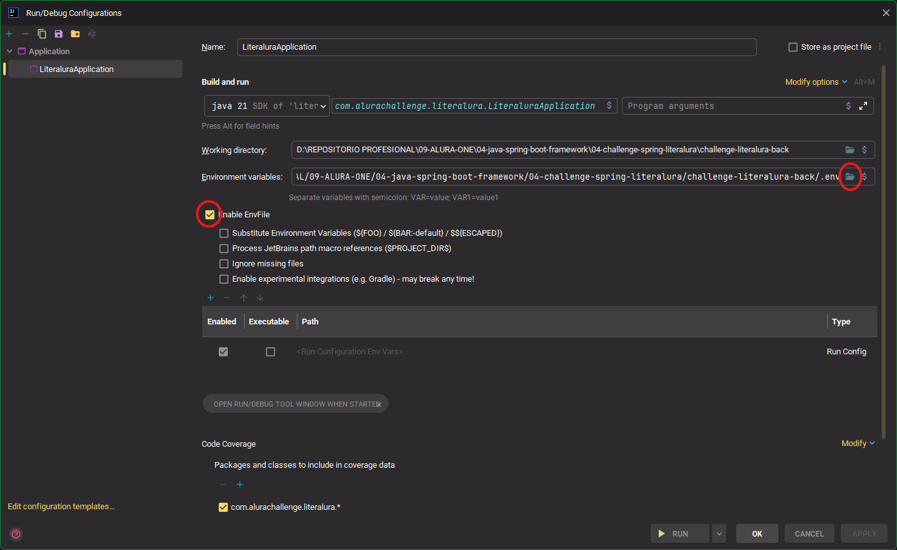
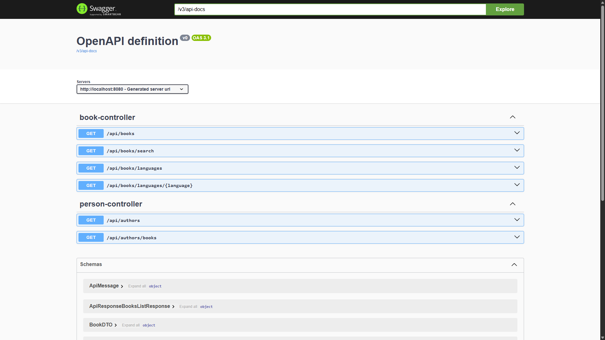

# CHALLENGE LITERALURA BACK END

API REST ( actualmente solo implementa el método GET) para gestionar libros y autores, implementada en Java con Spring
Boot, como parte del challenge de Alura Latam / Oracle en el programa ONE.

---

## 📌 Tecnologías

- **Java 21+**
- **Spring Boot** (Spring Web, Spring Data JPA)
- **PostgreSQL**
- **HttpClient**
- **Jackson** para JSON
- **Maven** como gestor de dependencias

---

## 🚀 Descripción

Este proyecto permite:

- Consumir la **Gutendex API** para obtener información de libros y autores.
- Almacenar los datos en una base de datos PostgreSQL.
- Exponer endpoints para:
    - Buscar y guardar libros por título.
    - Listar todos los libros.
    - Listar todos los autores (con sus libros).
    - Filtrar libros por idioma.
    - Listar todos los idiomas disponibles.
    - Obtener autores vivos en un año específico.

---

## 🛠️ Requisitos

- Java 17 o superior
- Maven 3.6+
- MySQL instalado y en ejecución

---

## ⚙️ Configuración

1. Clona el repositorio:
   ```bash
   git clone https://github.com/jfburgos55/challenge-literalura
   cd challenge-literalura
   ```

2. Crea una base de datos (por ejemplo, `literalura`)
3. Duplica el archivo `.env.template` y renómbralo como `.env`
4. Edita el archivo .env con tus valores locales:

  ```env
  DB_HOST=localhost
  DB_PORT=3306
  DB_NAME=challenge_literalura #La que se considere
  DB_USER=root
  DB_PASSWORD=123456
  
  EXTERNAL_API_BASE=https://gutendex.com
  EXTERNAL_API_TOKEN=(no requiere, dejar vacío)
  
  CORS_ALLOWED_ORIGINS=http://localhost:3306
  ```

5. Configura tambien `src/main/resources/application.properties`, si lo necesitas.
6. En IntelliJ IDEA, vamos a configurar nuestro archivo .env, para que pueda ser utilizado.
7. En la parte superior derecha del IntelliJ, dar clic en lo 3 puntos verticales y clic en Edit




8. En Environment variables, clic el icono de la carpeta y seleccionamos el archivo .env
9. Marcamos `Enable EnvFile`
10. Clic en APPLY y luego en OK.
11. Ejecutamos el proyecto, a traves del archivo `LiteraluraApplication`, dando clic derecho, Run

---

## 📄 Endpoints

| Método | Ruta                         | Descripción                                           |
|-------:|------------------------------|-------------------------------------------------------|
| `POST` | `/books?title=<título>`      | Trae desde Gutendex y guarda un libro (si no existe). |
|  `GET` | `/books`                     | Devuelve todos los libros registrados.                |
|  `GET` | `/books/lang/{lang}`         | Busca libros por idioma (`en`, `es`, etc.).           |
|  `GET` | `/languages`                 | Retorna lista de idiomas disponibles.                 |
|  `GET` | `/authors`                   | Devuelve autores con su lista de libros.              |
|  `GET` | `/authors/alive?year={aaaa}` | Retorna autores vivos en el año indicado.             |

---

## 🧾 Documentación de la API

Una vez que el proyecto está corriendo, puedes acceder a la documentación interactiva desde:

  ```bash
  
  http://localhost:8080/swagger-ui.html
  
  ```

Allí podrás:

- Explorar todos los endpoints disponibles

- Ver detalles de cada operación

- Probar peticiones directamente desde el navegador



---

## 📘 ¿Es esta una API REST?

Sí. Esta API sigue el estilo REST, aunque actualmente solo implementa el método GET para realizar operaciones de
lectura. Esto la convierte en una API RESTful de solo lectura.

Se basa en los principios REST:

- Acceso a recursos a través de URLs semánticas.

- Uso adecuado de métodos HTTP (GET).

- Comunicación sin estado (stateless).

- Respuestas estructuradas en formato JSON.

---

## 📚 Licencia

Este proyecto está bajo la licencia MIT.

---

## 🤝 Créditos

Desarrollado como solución al Backend Challenge de Alura Latam / Oracle ONE.